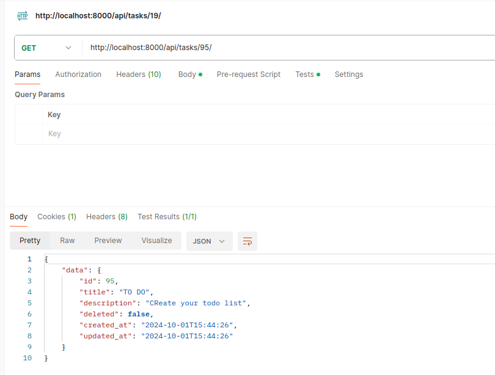

# Task Tracker Django Project

This project is a Django application for task management, using MySQL as the database. It includes a Docker setup for easy deployment and management.

## Table of Contents
- [Features](#features)
- [Requirements](#requirements)
- [Setup](#setup)
- [API Endpoints](#api-endpoints)
- [Screenshots](#screenshots)
- [Tests](#tests)


## Features
- Create, Read, Update, and Delete (CRUD) tasks.
- Paginated task retrieval.
- Built with Django REST Framework and documented with Swagger.


## Requirements
- MySQL
- Python 3.12

## Setup

### 1. Clone the Repository
```bash
git clone https://github.com/yourusername/task_tracker.git
cd task_tracker
```

### 2. Set up and start the application
```bash
docker-compose up -d
```

### 3. Access the Application and Database
You can access the application at:
```bash
http://localhost:8000
```
MySQL Database
```bash
localhost:3306
```

### 4. And the Swagger documentation at:
```bash
http://localhost:8000/swagger/
```

## API Endpoints
```bash
GET /tasks/: Retrieve a list of tasks.
GET /tasks/{id}/: Retrieve a specific task by ID.
POST /tasks/: Create a new task.
PUT /tasks/{id}/: Update an existing task by ID.
DELETE /tasks/{id}/: Delete a task by ID.
```

## Screenshots

#### Create task


#### Create task without required field title


#### Get specific task


#### Get all tasks


#### Updating Task with Success response


#### Deleting a task that does not exist


## Tests
#### Run tests
```bash
docker-compose run web pytest /task_tracker/tests
```


